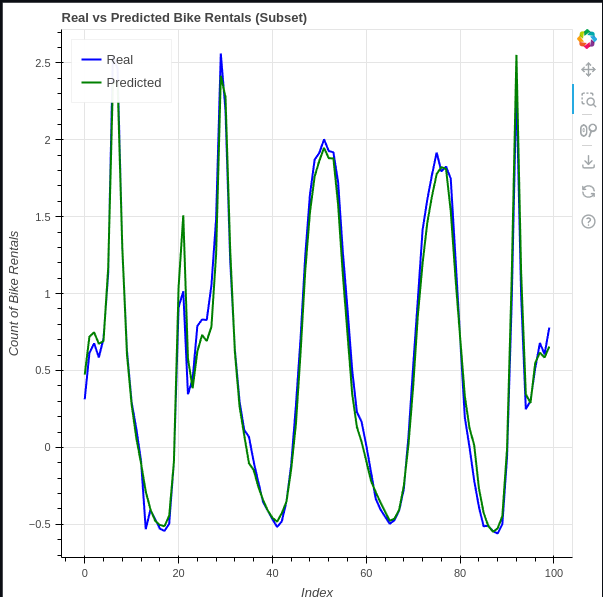

# Time Series Prediction using RNN (LSTM) for Bike Sharing Dataset

*results are presented in the [Jupyter Notebook](RNN_For_Bike_Sharing_Dataset_Assignment.ipynb)*

This project uses a London bike-sharing dataset from Kaggle, which contains hourly records of bike rentals in the city. The data includes details such as weather conditions, holidays, and weekends, making it ideal for time series analysis to predict bike rental counts.

**Dataset Source:** [Kaggle - London Bike Sharing Dataset](https://www.kaggle.com/datasets/hmavrodiev/london-bike-sharing-dataset)

## 1. Data Exploration and Preparation

The dataset includes features like temperature, humidity, wind speed, weather conditions, and whether a day is a holiday or weekend. A feature engineering process was conducted to normalize data, encode categorical features, and remove highly correlated variables.

The key steps include:
- Correlation analysis to remove features with correlation above 0.85.
- One-hot encoding for categorical features like weather, holiday, weekend, and season.
- Scaling numerical data using `RobustScaler`.

## 2. Model Architecture

The model is based on a Recurrent Neural Network (RNN) using LSTM layers to capture temporal dependencies in the dataset.

### Key Layers:
1. **LSTM Layer (32 units)**: Captures time-dependent patterns in bike rentals.
2. **Dropout Layer (0.3)**: Prevents overfitting by randomly dropping neurons during training.
3. **Dense Output Layer**: Outputs the predicted bike rentals count.

### Model Summary:
```python
model = Sequential()
model.add(LSTM(32, activation='relu', return_sequences=True, input_shape=(X_train.shape[1], X_train.shape[2])))
model.add(Dropout(0.3))
model.add(Dense(1))
model.compile(optimizer=Adam(learning_rate=0.001), loss=Huber(), metrics=["mse", 'mae'])
```

## 3. Metrics Selection

The following metrics were used to evaluate the model:
- **Huber Loss**: A robust loss function that balances MSE and MAE, making it effective for handling outliers in the dataset, such as unexpected weather or holiday patterns.
- **MSE (Mean Squared Error)**: Penalizes large errors more heavily, useful for predicting bike rentals with high accuracy.
- **MAE (Mean Absolute Error)**: Provides a simple, interpretable measure of average error.

## 4. Model Training

We used early stopping and learning rate reduction to prevent overfitting and improve model convergence. The training and validation losses quickly decreased, indicating effective learning, and converged after a few epochs, with low overfitting.

```python
early_stop = EarlyStopping(monitor='val_loss', patience=10, restore_best_weights=True)
reduce_lr = ReduceLROnPlateau(monitor='val_loss', factor=0.2, patience=5, min_lr=0.0001)
history = model.fit(X_train, y_train, epochs=50, batch_size=64, validation_data=(X_test, y_test), callbacks=[early_stop, reduce_lr], verbose=1)
```

## 5. Results
*github does not render bokeh plots correctly. Below is a screenshot of the results from the notebook, normalizing the data.


The LSTM model captures the trends in bike rentals and generalizes well on the test data. The use of Huber Loss and other metrics helps balance prediction accuracy and robustness against outliers. Future improvements could focus on better capturing extreme fluctuations during high-demand periods.
